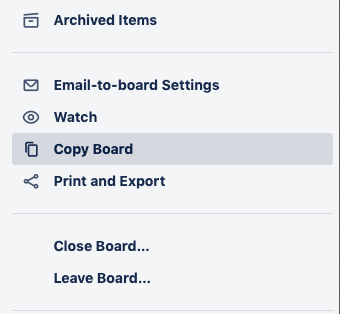
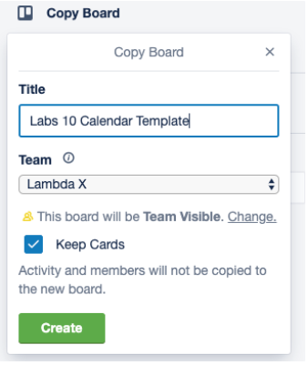
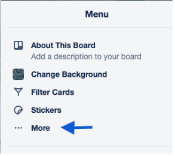
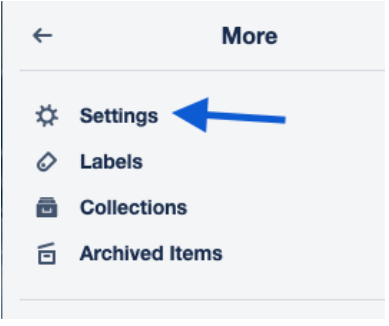
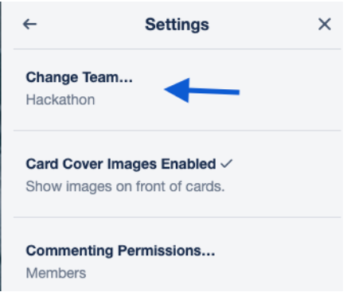
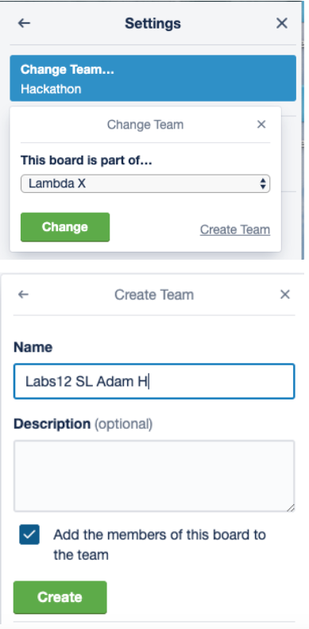

# Trello Board Creation  

There can only be 8 or less boards live on the Lambda X team at any given time, so we have to utilize making different teams to get boards created for all of the Labs projects.

Get access to the Labs Template here: [https://trello.com/invite/lambdalabsx/b4100c6a847261bfa2abdb720268fe6f](https://trello.com/b/ln03jruA/labs-project-template)

1. First, click "Show Menu" in the top right-hand corner and click "more". From there, click “Copy Board”.

2. Name the board Labs [number] [project name] Ex: Labs 10 Calendar Template

3. Open the menu and click more

4. Then go to Settings:

5. Then Change team:

6. Create a new team OR if you have already created a team move the board to it.

## **Important Reminder**

When you go to add Team Members, please make sure you add your Engineering Manager, Product Manager, Design Manager, *and* Section Lead as *ADMIN*

