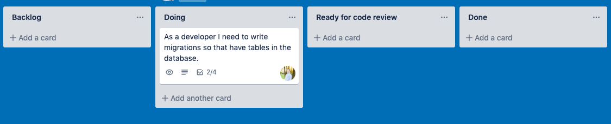
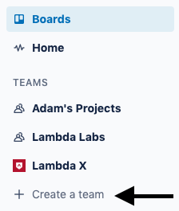
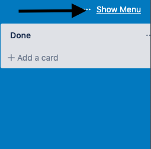
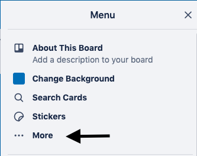
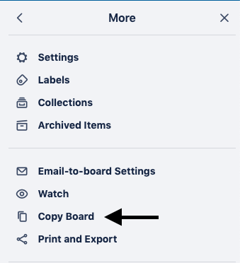
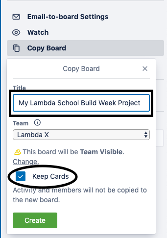
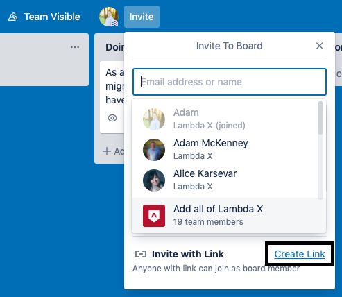

# How to setup Trello scaffolding

### How to clone the scaffolding:

📌 In the left sidebar of Trello create a new team for your project.

📌 Navigate to the [Labs Trello Scaffolding](https://trello.com/b/R2AF3FY0/build-week-scaffolding), and clone it. Start by clicking on `show menu` at the top right of the page.

📌 click on _more_

📌 click on _copy board_

📌 Give your board a title, add it to the new team you made, and make sure `keep cards` is checked.

📌 Once your board is created, use the `invite with link` option and pin the link to your team's slack channel so they can all access the board.

