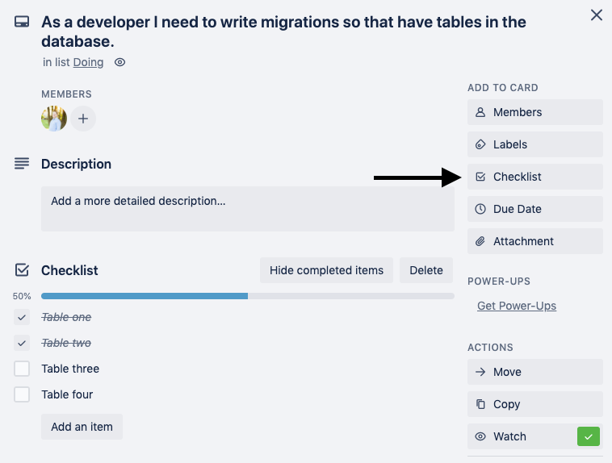
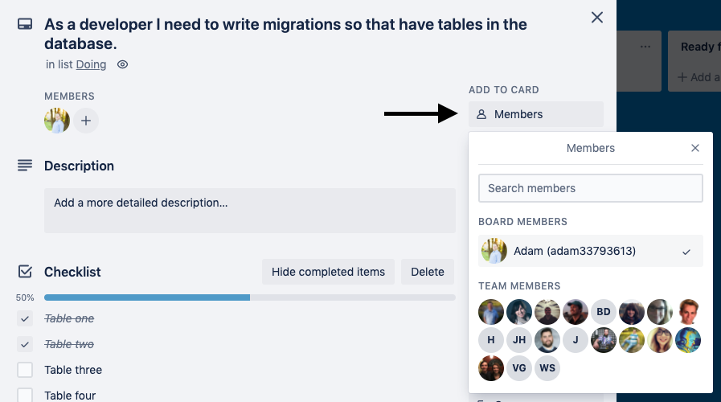
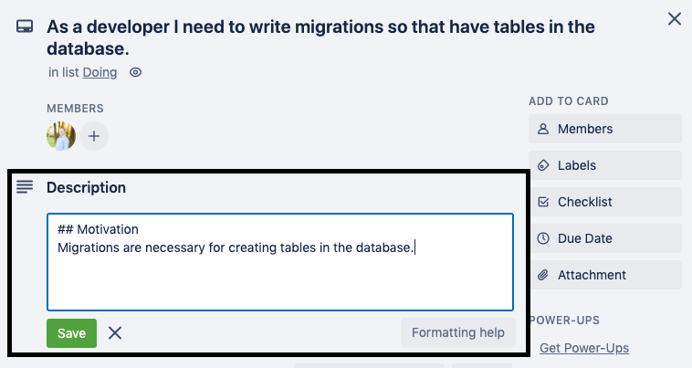
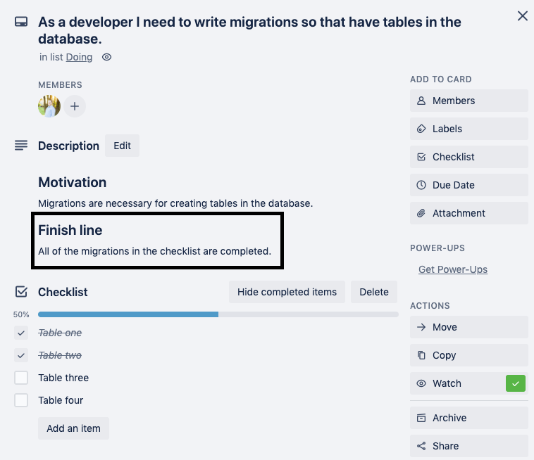

# Turn user stories into tasks on Trello

**`Important:` At any given time, manager should be able to tell exactly what every member of the team is currently working on in your project by looking at your Trello Board.**

As a developer adding tasks to Trello, you should always look at the tasks from the lens of the end user. Add `all` of your user stories to the backlog column `before you start to write any code.` Each user story should be `1 to 2 days of work` max.

**User story template:**

**As a **\_\_\_\_\_\_\_\_**,** ← persona

**I want **\_\_\_\_\_\_\_\_**,** ← feature

**so that **\_\_\_\_\_\_\_\_**.** ← need. This is easily overlooked, but provides important context.

_Example:_ `As a` potential customer, `I want` to see a landing page that has replaces all Lorem Ipsum placeholder text replaced with actual text that explains what this app does `so that` I have real explanations of what the app does.

## Keeps Tasks Small in user stories

### User stories should be broken down into granular tasks that can generally be done in a day or less.

_Bad example:_ As a user I want my app to have a backend so that I have an API for the front end.

### _Good Example:_

-   As a developer I need initial node/express boiler plate setup and pass a sanity check in postman so that I know there are no errors.
-   As a developer I need to implement knex and setup a knexfile in the root of the app so that I have a way to write migrations.

📌 **Use checklists in cards where necessary:**

📌 When a card is moved to the `doing` column, add the team member(s) that is working on that task to the card.

## Motivation

Motivation takes the `"so that"` one step further. It should be 1 - 3 sentences. When this is done correctly it should make the purpose of the task abundantly clear to a manager that wasn't there in the planning stages of your project.

`note:` Markdown can be used in Trello. The two hashtags make a heading.

## Finish Line

Finish line sets a 100% clear standard for the developer working on the task to know they are done and the card can be moved to the `ready for code review` column.

## Other guidelines

-   There should never be more cards in the `Doing` column than there are members of your team
-   No team members should be on more than one card in the `Doing` column
-   User stories should be ordered by priority in the `To Do` column with the most important tasks at the top.
-   When team members finish a task they should start on the task that is most important, not most appealing.
