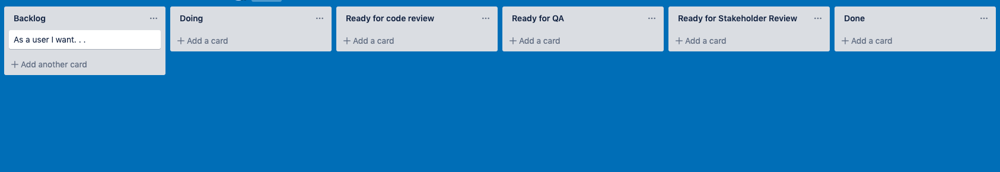
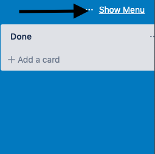
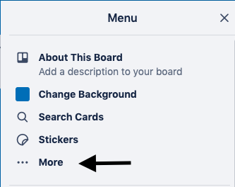
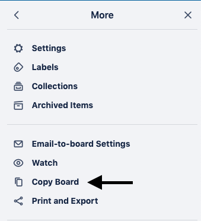

# How to use Trello

## Setup your scaffolding

Navigate to the [Labs Trello Scaffolding](https://trello.com/b/R2AF3FY0/build-week-scaffolding), and clone it or re-produce it.

### How to clone the scaffolding:

📌 Click on _show Menu_

📌 click on _more_

📌 click on _copy board_

## User Stories

-   As a developer adding tasks to Trello, you should always look at the tasks from the lens of the end user.

**As a **\_\_\_\_**,** ← persona - who will be using this feature?

**I want **\_\_\_\_**,** ← feature - describe the feature.

**so that \*\***\_\***\*.** ← need - describe the need.

_Example:_ **As a potential customer,** **I want to see a landing page** that has replaces all Lorem Ipsum placeholder text replaced with actual text that explains what this app does **so that I have real explanations** of what the app does.

## Keeps Tasks Small

-   User stories should be broken down into granular tasks that can generally be done in a day or less.

    ### _Bad example:_ As a user I want my app to have a backend so that I have an API for the front end.

    ### _Good Example:_

    -   As a developer I need initial node/express boiler plate setup and pass a sanity check in postman so that I know there are no errors.
    -   As a developer I need to implement knex and setup a knexfile in the root of the app so that I have a way to write migrations.
    -   As a developer I need to write migration for the database so that have table for in the database for

        _Checklist:_

        -   [ ] Table one
        -   [ ] Table two
        -   [ ] Table three
        -   [ ] Table four

    -   As a developer I need to write endpoints so the client can access the API so that unique data can be served to the front end.

        _Checklist:_

        -   [ ] Endpoint one
        -   [ ] Endpoint two
        -   [ ] Endpoint three
        -   [ ] Endpoint four
