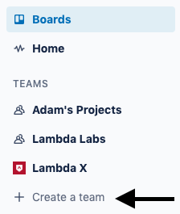
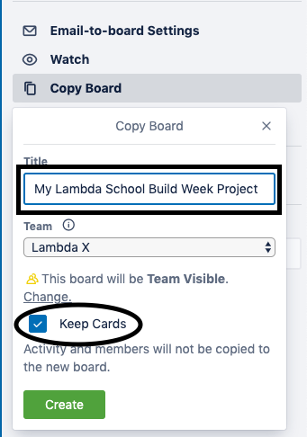
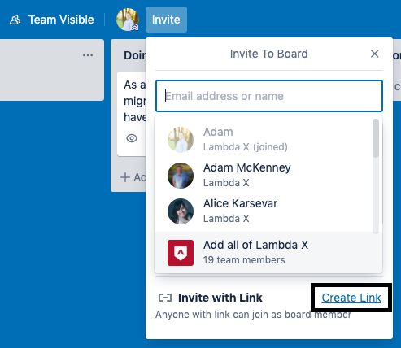
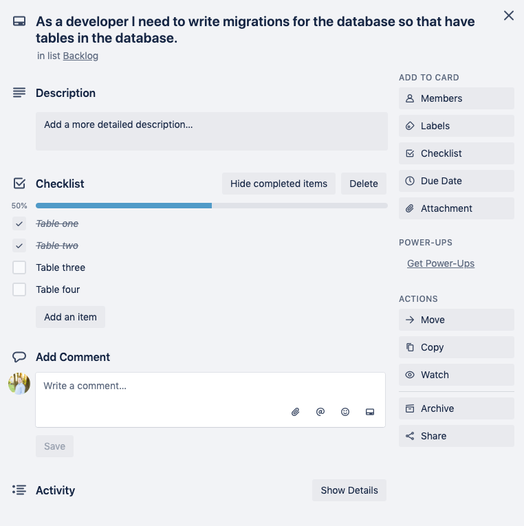

# How to use Trello

## Setup your scaffolding

### How to clone the scaffolding:

📌 In the left sidebar of Trello create a new team for your project.

📌 Navigate to the [Labs Trello Scaffolding](https://trello.com/b/R2AF3FY0/build-week-scaffolding), and clone it.

📌 Click on _show Menu_

📌 click on _more_

📌 click on _copy board_

📌 Give your board a title, add it to the new team you made, and make sure `keep cards` is checked.

📌 Once your board is created, use the `invite with link` option and pin the link to your team's slack channel so they can all access the board.

## User Stories

### **`Important:` A manager should be able to tell exactly what every member of the team is currently working on in your project by looking at your Trello Board.**

### As a developer adding tasks to Trello, you should always look at the tasks from the lens of the end user. Add `all` of your user stories to the backlog column `before you start to write any code.`

**User story template:**

**As a **\_\_\_\_\_\_\_\_**,** ← persona

**I want **\_\_\_\_\_\_\_\_**,** ← feature

**so that **\_\_\_\_\_\_\_\_**.** ← need. This is easy to overlook, but provides important context.

_Example:_ `As a` potential customer, `I want` to see a landing page that has replaces all Lorem Ipsum placeholder text replaced with actual text that explains what this app does `so that` I have real explanations of what the app does.

## Keeps Tasks Small in user stories

### User stories should be broken down into granular tasks that can generally be done in a day or less.

_Bad example:_ As a user I want my app to have a backend so that I have an API for the front end.

### _Good Example:_

-   As a developer I need initial node/express boiler plate setup and pass a sanity check in postman so that I know there are no errors.
-   As a developer I need to implement knex and setup a knexfile in the root of the app so that I have a way to write migrations.

**Use checklists in cards where necessary:**

    -   As a developer I need to write endpoints so the client can access the API so that unique data can be served to the front end.

        _Checklist:_

        -   [ ] Endpoint one
        -   [ ] Endpoint two
        -   [ ] Endpoint three
        -   [ ] Endpoint four
